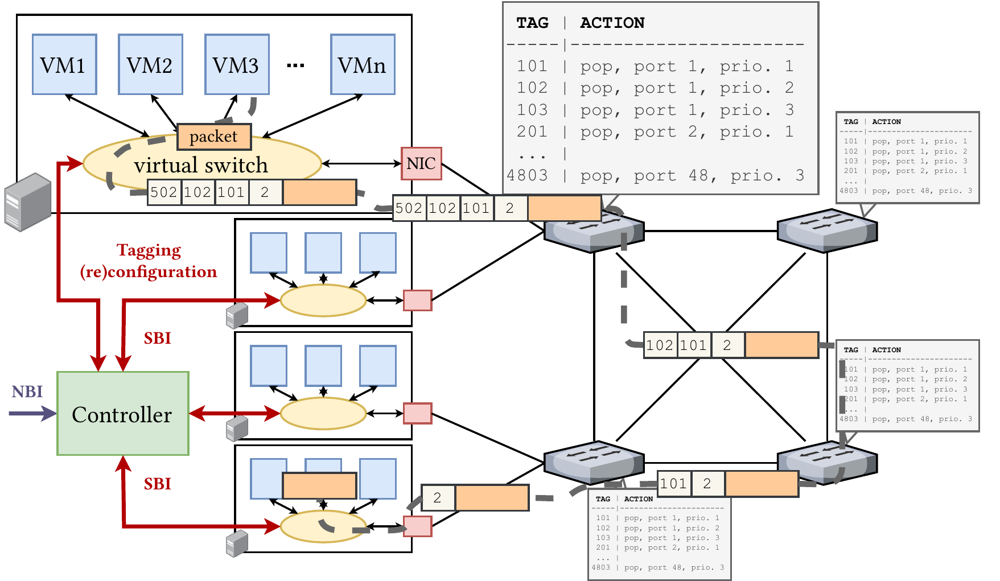

# SBI

This project implement an OpenFlow 1.0 controller southbound interface (SBI) using the [ECES](https://github.com/AmoVanB/eces-core) framework.

The module corresponds to the reference implementation of the SBI of the network controller for the **Chameleon** networking system for predictable latency in programmable networks published in:
- [Amaury Van Bemten, Nemanja Ðerić, Amir Varasteh, Stefan Schmid, Carmen Mas-Machuca, Andreas Blenk, and Wolfgang Kellerer. "Chameleon: Predictable Latency and High Utilization with Qu    eue-Aware and Adaptive Source Routing." ACM CoNEXT, 2020](https://mediatum.ub.tum.de/doc/1577772/file.pdf).

## Usage

The project can be downloaded from maven central using:
```xml
<dependency>
  <groupId>de.tum.ei.lkn.eces</groupId>
  <artifactId>sbi</artifactId>
  <version>X.Y.Z</version>
</dependency>
```

The module can for example be started with the following snippet:

```java
Set<ExpectedHost> hosts = new HashSet<>();
hosts.add(new ExpectedHost(InetAddress.getByName("scholes.forschung.lkn.ei.tum.de"), "0000:04.00.0"));
hosts.add(new ExpectedHost(InetAddress.getByName("kane.forschung.lkn.ei.tum.de"), "0000:04.00.0"));
hosts.add(new ExpectedHost(InetAddress.getByName("gerrard.forschung.lkn.ei.tum.de"), "0000:04.00.0"));

Set<InetAddress> switches = new HashSet<>();
switches.add(InetAddress.getByName("leicester.forschung.lkn.ei.tum.de"));
switches.add(InetAddress.getByName("watford.forschung.lkn.ei.tum.de"));
switches.add(InetAddress.getByName("newcastle.forschung.lkn.ei.tum.de"));
switches.add(InetAddress.getByName("tottenham.forschung.lkn.ei.tum.de"));
switches.add(InetAddress.getByName("liverpool.forschung.lkn.ei.tum.de"));
switches.add(InetAddress.getByName("mancity.forschung.lkn.ei.tum.de"));
switches.add(InetAddress.getByName("westham.forschung.lkn.ei.tum.de"));
switches.add(InetAddress.getByName("fulham.forschung.lkn.ei.tum.de"));
switches.add(InetAddress.getByName("chelsea.forschung.lkn.ei.tum.de"));

new SBISystem(controller, networkingSystem, network, hosts, switches, 10, 3, false);
```

## Architecture



Chameleon relies on source routing for providing predictable latency in programmable networks.
Servers (i.e., end hosts) run virtual machines (VMs) that wish to communicate with each other in the network.

Packets sent by VMs are captured in a virtual switch that is responsible for tagging (with VLAN tags) and shaping flows.
The tags the virtual switch adds correspond to the successive actions the switches in the network must take when they receive the packet.
Each time a switch receives a packet, it outputs it to a particular output port and queue based on the outermost VLAN tag and pops the latter.

The switches are configured at the startup of the network with static rules: a particular outermost VLAN tag corresponds to a particular output port and queue.
The configuration of a new flow simply requires to update the tagging rules in the virtual switch of the source VM.

More details about the architecture, the implementation, the goal, and the performance of Chameleon can be found in the [2020 CoNEXT article](https://mediatum.ub.tum.de/doc/1577772/file.pdf) where the system was originally published.
Section 4.1 focuses on the implementation of the control part.

 
## Operations

- Upon startup, the module connects to the `ExpectedHost`s passed as parameter and checks that they satisfy all the requirements (see below).
- The module then waits for all the expected switches passed as parameter to initiate an OpenFlow 1.0 connection. 
- When a switch successfully connects, the module installs the static rules that match each output port / queue combination to a VLAN tag.
- When all the expected switches are connected, the module starts topology discovery by sending LLDP packets (see [send-lldp.py](https://github.com/AmoVanB/chameleon-end-host/blob/master/topology_discovery/send-lldp.py) script) from the servers into the network and from each switch to all its neighbor switches. The discovered topology is created in the [network](https://github.com/AmoVanB/eces-network) module.
- Once the topology is discovered, the module starts the Chameleon virtual switch on all the servers (see [start-dpdk-application.sh](https://github.com/AmoVanB/chameleon-end-host/blob/master/virtual_switch/start-dpdk-tagging.sh) script). 
- Once all the virtual switches are started, the module waits for events from the [tenant manager](https://github.com/AmoVanB/eces-tenant-manager) module:
    - When a new `VirtualMachine` is created by the tenant manager, the SBI module actually spins up the VM on the corresponding server (see the [create-vm](https://github.com/AmoVanB/chameleon-end-host/blob/master/virtual_machines/create-vm.sh) script).
    - When a new `Flow` is created by the tenant manager and routed by the [routing](https://github.com/AmoVanB/eces-routing) module, the SBI module configures the corresponding matching rule in the virtual switch of the source VM (using the [update-matching-table.py](https://github.com/AmoVanB/chameleon-end-host/blob/master/virtual_machines/update-matching-table.py) script).

## Requirements

The Chameleon code and scripts for the end hosts, their VMs, and the Chameleon virtual switch are available [here](https://github.com/AmoVanB/chameleon-end-host).

For end hosts (checks for that are implemented at startup in the `checkDependenciesOnExpectedHostsAndInitialize` method of the [SBISystem](src/main/java/de/tum/ei/lkn/eces/sbi/SBISystem.java)):
- They are supposed to be reachable over `ssh` as `root` and using the private key stored in `~/.ssh/id_rsa`.
- They must have `perl`, `python3`, `scapy`, `docker`, and `vagrant` installed (see the [install-dependencies.sh](https://github.com/AmoVanB/chameleon-end-host/blob/master/install-dependencies.sh) script).
- They must have the Chameleon `start-dpdk-tagging` (starts the Chameleon virtual switch), `stop-dpdk-tagging`, `create-vm`, `delete-vm`, and `list-vms` scripts installed under `/usr/bin` (see the [deploy-scripts.sh](https://github.com/AmoVanB/chameleon-end-host/blob/master/deploy-scripts.sh) script). 
- The base vagrant box must be already created (using the [create-base-box.sh](https://github.com/AmoVanB/chameleon-end-host/blob/master/virtual_machines/create-base-box.sh) script).
- See also the [Chameleon virtual switch README](https://github.com/AmoVanB/chameleon-end-host/blob/master/README.md) for the configurations to ensure that the virtual switch exhibits a predictable latency.

The switches must be OpenFlow 1.0 switches that support priority queuing, and VLAN matching and popping.

Relevant switch performance parameters (processing time, priority queuing overhead, number of queues, and per-queue buffer size) must be configured in the [SwitchCapabilities](src/main/java/de/tum/ei/lkn/eces/sbi/SwitchCapabilities.java) class.
The parameters configured in this repository corresponds to those measured for our switches in our article:
- [Amaury Van Bemten, Nemanja Ðerić, Amir Varasteh, Andreas Blenk, Stefan Schmid, and Wolfgang Kellerer. "Empirical predictability study of SDN switches." ACM/IEEE ANCS, 2019](https://mediatum.ub.tum.de/doc/1519345/file.pdf).